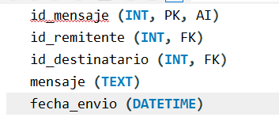

##Descripción de la Temática de la Base de Datos

Me salio un proyecto de un ecommerce para el mes que viene, entonces la idea es hacerlo con sql y no Mongo que es lo que uso el dia a dia
La aplicacion web se basa en un ecommerce que te permite rentar obras de arte para producciones, filmaciones de cine, series, eventos etc...

Tiene que tener un sistema que permita rentar las obras seleccionadas si es que estan disponibles, eleguir una fecha de entrega y otra de devolucion, se calcula el costo depende la obra y los dias y el traslado
que se requiera.
Tiene que tener un sistema para registrar usuarios(crud)
Tiene que tener un sistema de notificaciones
Sistema de chat
Sistema para el administrador donde pueda ver todas las obras de artes y el estado de cada una.
La base de datos para el e-commerce de alquiler de obras de arte gestionará información sobre usuarios, obras de arte, alquileres, pagos, mensajes, preguntas y respuestas, y publicidad. Esta base de datos soportará las operaciones de un e-commerce, incluyendo la gestión de catálogos, transacciones financieras, y la comunicación entre usuarios y administradores.

##Diagramas de Entidad-Relación

El diagrama de entidad-relación.
(no se si esta bien descripto de esta manera pero es lo que se me ocurrio)

    Usuarios: Usuarios registrados en la plataforma.
    Obras de Arte: Información sobre las obras disponibles para alquiler.
    Alquileres: Registro de cada alquiler realizado.
    Pagos: Detalles de los pagos asociados a los alquileres.
    Mensajes: Comunicación entre usuarios y administradores.
    Preguntas y Respuestas: Preguntas frecuentes y respuestas.
    Publicidad: Imágenes y mensajes de publicidad en el sitio web.

1. Tabla usuarios
   Información de los usuarios registrados.
   Campos:

2. Tabla obras_arte

   Información sobre las obras de arte disponibles para alquiler.
   Campos:

 

3. Tabla alquileres

   Información sobre los alquileres realizados.
   Campos:

4. Tabla pagos

   Información sobre los pagos realizados.
   Campos:

5. Tabla mensajes

   Comunicación entre usuarios y administradores.
   Campos:

6. Tabla preguntas_respuestas

   Preguntas frecuentes y sus respuestas.
   Campos:

7. Tabla publicidad

   Imágenes y mensajes de publicidad en el sitio web.
   Campos:

 
